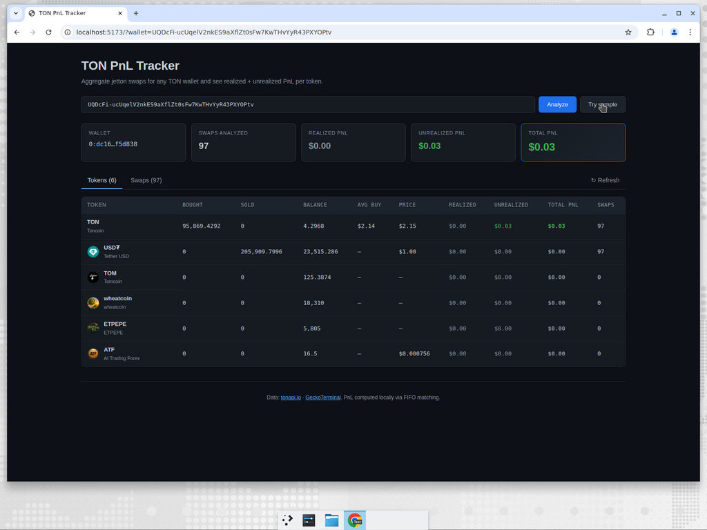
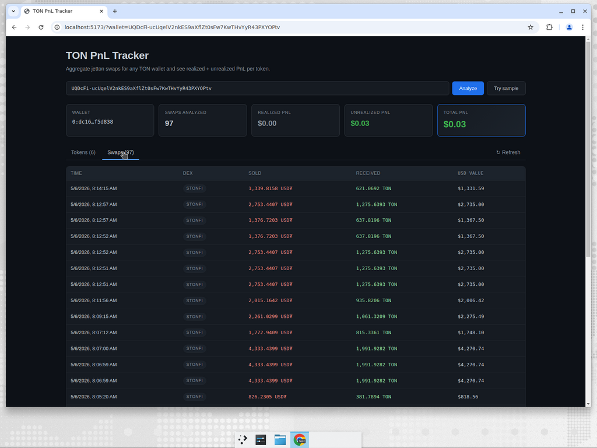

# TON PnL Tracker

Aggregate jetton swaps for any TON wallet and compute realized + unrealized PnL per token.

- **Backend** — FastAPI service that pulls events from [tonapi.io](https://tonapi.io), normalizes `JettonSwap` actions, prices them in USD via [GeckoTerminal](https://www.geckoterminal.com), and computes FIFO PnL per token.
- **Frontend** — Vite + React + TypeScript dashboard with a wallet input, summary cards (realized / unrealized / total), token table sorted by absolute PnL, and a paginated swap log.

## Features

- Reads transaction events from `tonapi.io` with paginated `before_lt` cursors.
- Recognizes `JettonSwap` actions across STON.fi v1/v2 and DeDust, including multi-hop swaps that tonapi flags as `status=failed` even though funds settled.
- Collapses Proxy-TON wrappers (pTON v1 / v2) into native TON for accurate position tracking.
- Prices swaps in USD by:
  1. Using the TON leg of a swap as ground-truth USD (TON ≈ USDT/USD via the deepest USDT/TON pool, inverted).
  2. Falling back to the deepest TON-paired pool's hourly OHLCV close for jetton-only swaps.
- Computes FIFO realized PnL per token, with auto-funded cost basis when the wallet sells more than our visible history shows it bought (incoming transfers, airdrops). Excess on-chain balance over the FIFO tail is treated as a zero-cost-basis position so we don't book phantom profit.
- Reconciles FIFO lots with on-chain balances after each report so non-swap outflows (TON transfers, jetton transfers out) drain the oldest lots first.
- Caches results per wallet for 5 minutes; force a fresh pull with `?refresh=true`.

## Screenshots




## Repository layout

```
backend/   FastAPI service (Python 3.11+)
frontend/  Vite + React + TypeScript dashboard
```

## Prerequisites

- Python 3.11+ and [`uv`](https://github.com/astral-sh/uv) (or vanilla `pip`).
- Node.js ≥ 20.19 / ≥ 22.13 for the frontend.
- Optional: a [tonapi.io](https://tonapi.io) API key — without it you're limited to the free public tier (~1 RPS).

## Quick start

### 1. Run the backend

```bash
cd backend
uv venv
source .venv/bin/activate
uv pip install -e ".[dev]"

# Optional: set your tonapi token, raise the per-wallet event cap, etc.
cp .env.example .env

uvicorn ton_pnl.main:app --reload --port 8000
```

The API exposes:

- `GET /api/health`
- `GET /api/wallet/{address}/pnl?limit=200&refresh=true` — returns a `PnLReport`.

The address can be either the user-friendly form (`EQ...` / `UQ...`) or the raw `0:<hex>` form.

Run the test suite and linter:

```bash
python -m pytest
python -m ruff check ton_pnl/ tests/
python -m ruff format ton_pnl/ tests/
```

### 2. Run the frontend

```bash
cd frontend
npm install

# Optional: point at a non-default backend URL.
cp .env.example .env

npm run dev
```

Open http://localhost:5173 and either type a TON wallet address or click **Try sample**.

Build / lint / preview:

```bash
npm run build
npm run lint
npm run preview
```

## How PnL is computed

For every `JettonSwap` we record the swap's USD value at the candle covering its timestamp:

1. **TON-leg priority.** If TON is on either side of the swap, we use `ton_amount × ton_usd(ts)`. Otherwise we price the bought asset (or sold asset as fallback) at its hourly close from its deepest TON-paired pool.
2. **FIFO matching.** For each swap we treat the *sold* asset as a sale against the queue of prior buy lots and the *bought* asset as a new lot. Realized PnL on the sold asset = proceeds - cost basis taken from the lot queue.
3. **Auto-funded cost basis.** If a sell exceeds tracked buys (e.g. TON used as base currency, jetton received via transfer), we auto-fund the missing amount at the swap's own USD value. Realized PnL on that portion is zero, which keeps TON's PnL ≈ 0 across normal trading and avoids phantom profit on un-tracked airdrops.
4. **On-chain reconciliation.** After processing, we reconcile each token's FIFO tail with the wallet's current on-chain balance:
   - If the wallet holds *less* than FIFO tracked, drain oldest lots first (preserves cost basis of recent buys).
   - If the wallet holds *more*, treat the excess as zero-PnL with cost basis = excess × current price.
5. **Unrealized PnL** = current value (on-chain balance × current GeckoTerminal price) − remaining cost basis.

## Data sources

- **tonapi.io** for account events, jetton balances, account info. Endpoints used: `/v2/accounts/{addr}`, `/v2/accounts/{addr}/events`, `/v2/accounts/{addr}/jettons`.
- **GeckoTerminal** for top liquidity pools, OHLCV history, and current USD prices.

Both are public APIs with rate limits — the backend retries on 429/5xx with exponential backoff and caches per-wallet reports for 5 minutes.

### Optional: tonviewer.com proxy mode

If the direct tonapi.io rate limits are too tight for your workload, you can route all tonapi calls through the tonviewer.com frontend proxy:

```env
TON_PNL_TONAPI_BASE_URL=https://tonviewer.com/api/tonapi
TON_PNL_TONAPI_HEADERS='{"User-Agent":"Mozilla/5.0 ...","Referer":"https://tonviewer.com/"}'
# Optional, only needed if tonviewer rotates their key:
# TON_PNL_TONVIEWER_PASSPHRASE=tv22-asrr11
```

tonviewer returns AES-encrypted bodies (CryptoJS-style `Salted__` blobs); the backend detects this from the base URL and transparently decrypts them using `TON_PNL_TONVIEWER_PASSPHRASE`. The default passphrase matches what their JS bundle ships today (extracted from `pages/_app-*.js`). In our local benchmarks we got ~30 RPS sustained on the public proxy with no rate limiting. Cookies are usually optional — `User-Agent` + `Referer` is enough to pass their WAF most of the time. If they ever rotate the encryption key, override `TON_PNL_TONVIEWER_PASSPHRASE` (you can grep their JS bundle for `AES.decrypt(`).

For long-term production use prefer a paid tonconsole.com key via `TON_PNL_TONAPI_TOKEN` — the tonviewer proxy is best-effort and could break at any time.

## Limitations

- Some jettons have no liquid TON-paired pool on GeckoTerminal; their swaps still appear but won't have a USD value or current price (PnL contribution = 0).
- Swap history is bounded by `TON_PNL_MAX_EVENTS_PER_WALLET` (default 1000). For very active wallets, raise this or call the endpoint with `?limit=`.
- The auto-funded cost basis is a best-effort heuristic — it cannot recover the *real* cost basis of tokens that entered the wallet outside our visible swap history.
